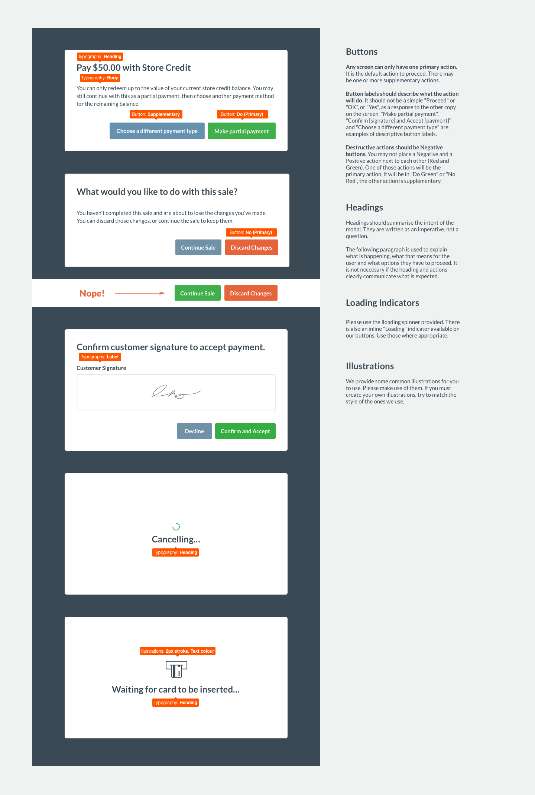

# PEG
Pay Example (PEG) is a Heroku hosted web service that demonstrates how an in-store cloud payment integration can be built to Vend's Payments API, enabling to be used on both Web and iOS platforms.

This project is intended as a guide for integrators, and includes Vendy styles and images that are free to be used.

## Contains
- Go Webservice (`main.go`)
- Vend Payments API JavaScript (`assets/js/pay.js`)
- Vend CSS Styles (`assets/css/vend-peg.css`)
- Vend Font Styles (`assets/fonts/*`)
- Vend Payment Imagery (`assets/images/*`)

## Deployment and use within Vend
PEG must be used within the Vend Pay Screen iFrame, as that's where it has access to the Payments API. Follow these steps to get set up within Vend.

1. Deploy the application to [Heroku](https://www.heroku.com/) so that you have full access to the logs (a current image that can be used, but is not likely to stick around, exists [here](https://radiant-everglades-52692.herokuapp.com/)).
2. Create a trial Vend account, and add a new Credit Card payment type, name it "Pay Example".
3. Edit the Pay Example payment type, and enter the newly created Heroku URL as the payment type gateway address. 
4. Go to the Sell Screen on Web or iOS, add a product, click Pay, and choose "Payment Example". This will launch a modal contaning the Pay Example app, allowing you to simulate the payment API flows. 

## Using our Front-end Assets
Your integration will show up in a modal, within Vend’s Sell screen. We would like that experience to feel cohesive so we’re publishing a toolkit along with PEG that will allow you to use Vend-native styles within your integration. 

Each version of PEG will ship with the latest styles from within Vend. 
We will endeavour to publish new versions of PEG whenever our design language receives a noticeable improvement.

1. You can install PEG into your project as a Bower dependency `bower install https://github.com/vend/peg`.
2. Once installed, make sure your Sass build system includes `bower_components` as a load (or include) path. See our `gulpfile` for an example of doing this with node-sass. (`includePaths: 'bower_components'`)
3. Import the PEG styles into your project: `@import 'peg/assets/css/vend-peg.scss'`.

## Resources
- [Pay Example Live (Heroku)](https://radiant-everglades-52692.herokuapp.com/)
- [Payments API Getting Started](https://docs.vendhq.com/docs/payments-api-getting-started)
- [Payments API Reference](https://docs.vendhq.com/docs/payments-api-reference)
- [Window.postMessage()](https://developer.mozilla.org/en-US/docs/Web/API/Window/postMessage)

## Licenses
- [MIT License](https://github.com/vend/peg/blob/master/LICENSE)
- [Google Open Source Font Attribution](https://fonts.google.com/attribution)
